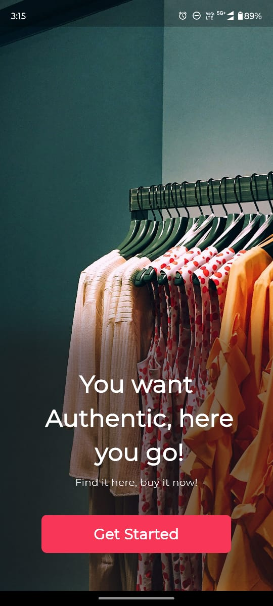
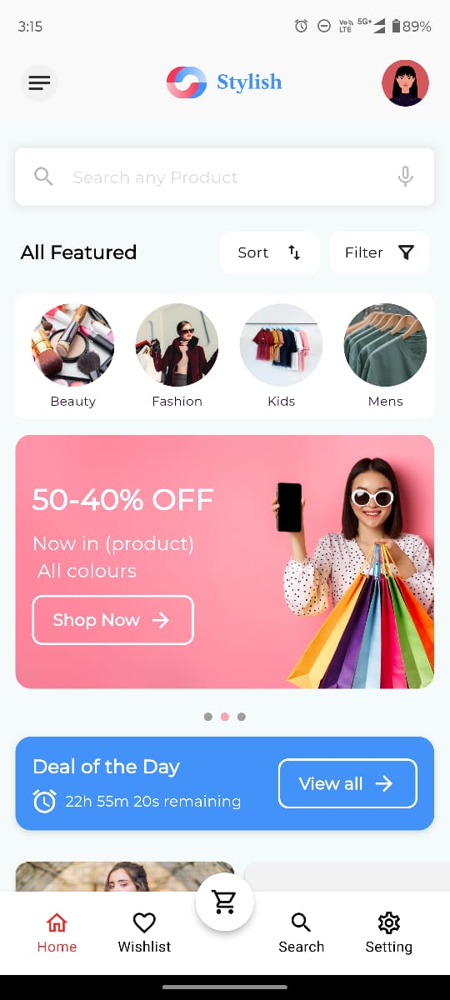
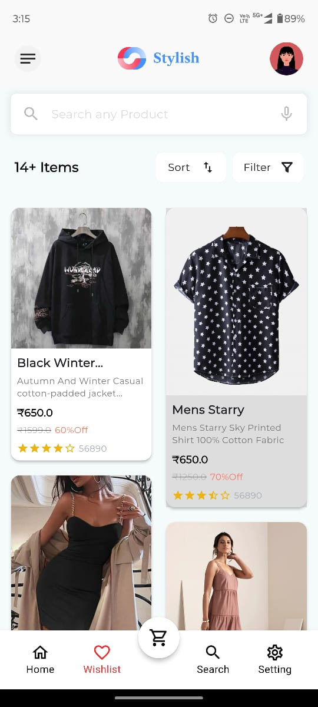

# Stylish - Flutter E-Commerce UI App

**Stylish** is a modern and intuitive E-Commerce UI application built using Flutter. This app showcases sleek design patterns and responsive layouts, perfect for exploring beautiful UI concepts for e-commerce applications.

---

## 🚀 Features

### Implemented Features:
- 📖 **Well Organized:** Modular Clean Code
- 📱 **Responsive Design:** Compatible with Android and iOS devices.
- 🛒 **Product Listing:** Dynamic product grids for seamless browsing.
---

## 🖥️ Screenshots and Demo

Here’s a preview of **Stylish**:

<table>
  <tr>
    <td align="center" style="padding: 10px;">
      
      <br/>
      <b>Welcome Screen</b>
    </td>
    <td align="center" style="padding: 10px;">
      
      <br/>
      <b>Home Screen</b>
    </td>
  </tr>
  <tr>
    <td align="center" style="padding: 10px;">
      
      <br/>
      <b>Product Listing</b>
    </td>
    <td align="center" style="padding: 10px;">
      
      <br/>
      <b>Wishlist Screen</b>
    </td>
  </tr>
  <tr>
    <td colspan="2" align="center" style="padding: 20px;">
      
      <br/>
      <b>App Demo</b>
    </td>
  </tr>
</table>

---

## 📦 APK Link[👉 Download Stylish APK](https://drive.google.com/file/d/1vcvKQPqypdUtpfmss9Il8g6-HAsUQmpS/view?usp=sharing)  
---

## 🛠️ Project Setup Instructions

Follow these steps to set up the project locally:

### Prerequisites:
- Install [Flutter SDK](https://flutter.dev/docs/get-started/install).
- Set up your IDE (VS Code/Android Studio) with Flutter and Dart plugins.
- Ensure you have an emulator or physical device ready for testing.

### Steps:
1. Clone the repository:
   ```bash
   git clone https://github.com/Aman-chatterjee/Stylish.git
   cd Stylish
   ```
2. Install dependencies:
   ```bash
   flutter pub get
   ```

3. Run the application:
   ```bash
   flutter run
   ```

---

🤝 Contributions
Contributions are welcome! Feel free to open an issue or submit a pull request for enhancements or bug fixes.

---

📧 Contact
If you have any questions or suggestions, feel free to reach out:

- *GitHub Profile: https://github.com/Aman-chatterjee*

- *Email: amanchatterjee121@gmail.com*


Thank you for checking out Stylish! 🚀
